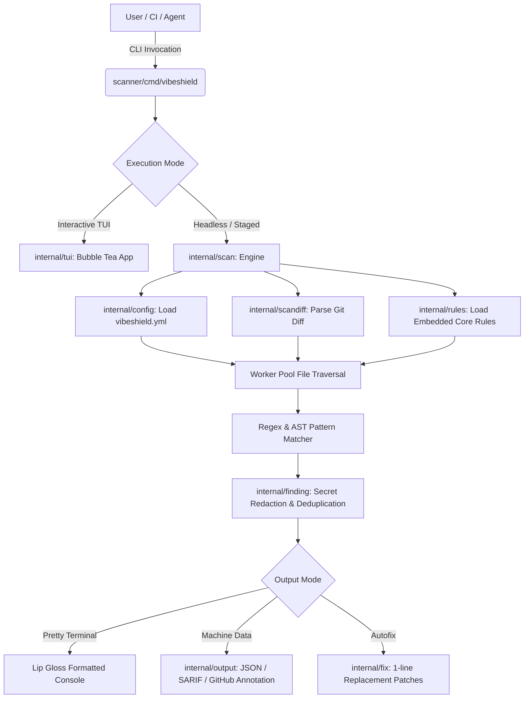

# VibeShield Codebase Architecture & Developer Guide

> **Single Source of Truth** for VibeShield developers, maintainers, and AI agents.
> Read this document first before writing code, proposing changes, or committing files.

---

## 1. Project Overview

**VibeShield** is an open-source, ultra-fast security and hallucination scanner engineered specifically for AI-generated ("vibe-coded") applications. AI models frequently echo hallucinated packages (slopsquatting attacks), hardcode leaked API credentials, disable TLS verification, and scaffold insecure defaults (wildcard CORS, `debug=True`, unhashed passwords, `eval()` sinks). VibeShield acts as an adversarial bug hunter: running locally in milliseconds as an interactive terminal UI (TUI), a headless pre-commit gate, a GitHub Action, or an AI agent skill—with **zero server dependencies and absolute privacy**.

---

## 2. Tech Stack & System Requirements

- **Core Scanner**: Pure Go (1.24+), zero CGO dependencies. Cross-compiled for 6 platforms (macOS ARM/x64, Linux ARM/x64, Windows ARM/x64).
- **Terminal UI**: Charm's Bubble Tea (`bubbletea`), Lip Gloss (`lipgloss`), Bubbles (`bubbles`).
- **Rules Engine**: Standardized YAML rule packs parsed and validated into memory, embedded directly into the Go binary via `//go:embed`.
- **Docs & Marketing Site**: Astro 5.x, TypeScript, Vanilla CSS (East Bay & Rum Swizzle design system), hosted on GitHub Pages.
- **Node.js Environment**: Node 20+ (Node 22 LTS recommended) used solely for maintenance scripts, site build, and the npm launcher wrapper.
- **OS Support**: Windows-first development (Git Bash / PowerShell), Linux, macOS.

---

## 3. Repository Folder Structure

```
vibeshield/
├── .agents/rules/              # Agent rule recipe for Google Antigravity & AI tools
├── .claude-plugin/             # Claude Code plugin marketplace declaration
├── .cursor/rules/              # Cursor IDE rules (.mdc format with YAML frontmatter)
├── .cursorrules                # Legacy Cursor IDE plain text rules file
├── .github/                    # GitHub configuration
│   ├── ISSUE_TEMPLATE/         # Bug, false positive, rule request templates
│   ├── workflows/              # CI/CD pipelines (ci, deploy-site, publish-npm, release)
│   ├── copilot-instructions.md # Copilot instructions generated from AgentRulesBody
│   └── PULL_REQUEST_TEMPLATE.md# Pull request template
├── .gitignore                  # Multi-layer git exclusion rules
├── .nojekyll                   # Bypasses Jekyll on GitHub Pages static deployment
├── .pre-commit-hooks.yaml      # Integration hook for pre-commit framework
├── .windsurf/rules/            # Windsurf Cascade agent rule recipe
├── .windsurfrules              # Windsurf root rule configuration
├── AGENTS.md                   # Canonical OpenAI Codex & universal AI agent rules
├── CHANGELOG.md                # Chronological release log and feature changelog
├── CLAUDE.md                   # Repository conventions for Claude Code and AI pair programmers
├── CODEBASE.md                 # THIS FILE — complete architectural map & guidelines
├── CODE_OF_CONDUCT.md          # Contributor Covenant Code of Conduct
├── CONTRIBUTING.md             # Developer setup, coding standards, and PR guidelines
├── LICENSE                     # MIT License
├── README.md                   # Public repository landing page and quickstart guide
├── SECURITY.md                 # Vulnerability reporting and responsible disclosure policy
├── _config.yml                 # Jekyll exclusions for GitHub Pages
├── action/                     # GitHub Action integration
│   ├── action.yml              # Composite Action definition
│   ├── entrypoint.sh           # Runner script executing binary and parsing findings
│   ├── templates/report.md     # PR markdown annotation comment template
│   └── test/fixtures/          # Sample finding JSON fixture for Action unit tests
├── contracts/                  # Formal API, CLI, finding, and rulepack specifications
│   ├── api.md                  # Design spec for future optional package-intel API
│   ├── cli.md                  # CLI flags, formats, exit codes contract (CI verified)
│   ├── finding/schema.json     # JSON Schema defining finding objects
│   └── rulepack.md             # YAML schema definition for rule packs
├── docs/                       # Architectural design documents & product strategy
│   ├── CLI_PLAN.md             # Terminal UI design and streaming scan plan
│   ├── agents.md               # Setup guide for AI coding agents
│   ├── growth.md               # Marketing, growth, and release launch notes
│   ├── redesign-plan.md        # Website design system specifications
│   ├── seo-plan.md             # Organic SEO content and meta architecture
│   └── site-facts.md           # Verifiable claims, metrics, and site copy facts
├── fixtures/golden/            # Test repositories for internal Go unit tests
│   ├── cors-star/              # Golden fixture testing wildcard CORS detection
│   ├── eval-on-input/          # Golden fixture testing dynamic eval sinks
│   ├── fake-keys/              # Golden fixture testing secret detection & redaction
│   ├── flask-debug/            # Golden fixture testing Flask debug=True detection
│   ├── go-tls-skipverify/      # Golden fixture testing InsecureSkipVerify detection
│   ├── hallucinated-package/   # Golden fixture testing unverified dependencies
│   ├── js-clean/               # Golden fixture asserting 0 false positives on clean code
│   ├── jwt-alg-none/           # Golden fixture testing JWT alg=none detection
│   ├── md5-password/           # Golden fixture testing MD5 password hashing detection
│   └── sql-concat/             # Golden fixture testing SQL string concatenation
├── npm/vibeshield/             # NPM package distribution wrapper
│   ├── bin/vibeshield.js       # Node launcher script resolving platform binary
│   ├── lib/run.js              # Binary download, verification, and spawn logic
│   └── package.json            # Published npm package definition
├── packaging/homebrew/         # Homebrew distribution documentation
├── rules/core/                 # Upstream YAML security and dependency rule packs
│   ├── dependencies.yaml       # Unpinned, wildcard, and git dependency rules
│   ├── license.yaml            # Copyleft and license violation detection rules
│   ├── packages.yaml           # Hallucinated and typosquatting package rules
│   ├── security-api.yaml       # SQLi, XSS, eval, and dangerous API sinks
│   ├── security-defaults.yaml  # Insecure server configurations, CORS, and debug flags
│   └── security-secrets.yaml   # Hardcoded API keys, JWT tokens, and private keys
├── scanner/                    # Core Go scanner implementation
│   ├── cmd/vibeshield/         # CLI commands (main, doctor, completion, help)
│   ├── internal/cli/           # Interactive console catalog & fuzzy search
│   ├── internal/config/        # Configuration parser (.vibeshield.yml / vibeshield.yml)
│   ├── internal/finding/       # Finding structs, severity levels, and secret redactor
│   ├── internal/fix/           # Autofix engine (safe 1-line patch generator)
│   ├── internal/initcmd/       # Project stack detector and setup bootstrapper
│   ├── internal/output/        # Output formats: pretty, JSON, SARIF, GitHub
│   ├── internal/rules/         # Rulepack parser, embed FS, and rule evaluator
│   ├── internal/scan/          # Worker pool, file traversal, and streaming scan engine
│   ├── internal/scandiff/      # Git diff parsing and line-intersection matching
│   └── internal/tui/           # Bubble Tea terminal application & Lip Gloss styles
├── scripts/                    # Development, synchronization, and release automation
│   ├── audit-contract.mjs      # CI gate: verifies binary matches contracts/cli.md
│   ├── bump-version.mjs        # Synchronized version bumper across manifests
│   ├── gen-homebrew-formula.mjs# Generates Homebrew formula with SHA-256 hashes
│   ├── install.ps1             # Windows PowerShell installer script
│   ├── install.sh              # Linux / macOS POSIX installer script
│   ├── sync-agent-rules.mjs    # Synchronizes AGENTS.md across all IDE agent configs
│   └── sync-rules.mjs          # Syncs rules/core/ into scanner/internal/rules/packs/
├── site/                       # Astro documentation and marketing website
│   ├── src/                    # Components, content collections, pages, styles
│   ├── public/                 # Static assets, badges, security.txt, robots.txt
│   ├── astro.config.mjs        # Astro configuration (base=/vibeshield/)
│   └── package.json            # Site dependencies and build scripts
├── skill/                      # Claude Code & Anthropic MCP plugin
│   ├── .claude-plugin/         # Plugin metadata manifest
│   └── skills/vibeshield-audit/# Auditing skill definition and execution scripts
└── vibeshield.yml              # Dogfood scanner configuration with justified exceptions
```

---

## 4. Entry Points & How to Run

### Development & Build
```bash
# 1. Build the Go scanner binary
cd scanner
go build -o vibeshield ./cmd/vibeshield
# On Windows:
go build -o vibeshield.exe ./cmd/vibeshield

# 2. Run the Documentation Website locally
cd site
npm install
npm run dev
```

### Running the CLI
```bash
# Interactive Terminal UI (TUI) Mode
./scanner/vibeshield

# Headless Scan (Full project)
./scanner/vibeshield scan .

# Pre-commit Staged Diff Scan (Scans only git-staged additions)
./scanner/vibeshield scan --staged

# Machine-Readable Output
./scanner/vibeshield scan . --format json
./scanner/vibeshield scan . --format sarif
./scanner/vibeshield scan . --format github

# Diagnostic System Check
./scanner/vibeshield doctor

# Interactive Search & Rule Inspection
./scanner/vibeshield search "eval"
./scanner/vibeshield rules VS-SEC-020

# Safe Autofix Preview
./scanner/vibeshield fix . --dry-run
```

### Running Test & Verification Gates
Always run the 4 mandatory contract gates before proposing changes:
```bash
# Gate 1: Go unit tests & formatting
cd scanner && go test ./... && go vet ./...

# Gate 2: Rulepack synchronization check
node scripts/sync-rules.mjs --check

# Gate 3: Agent rules synchronization check
node scripts/sync-agent-rules.mjs --check

# Gate 4: Contract compliance audit
node scripts/audit-contract.mjs scanner/vibeshield.exe

# Dogfood Self-Scan:
./scanner/vibeshield.exe scan . --format json
```

---

## 5. Architecture & Data Flow



### Architecture Principles
1. **Zero Outbound Network Calls**: The scanner binary contains no HTTP client. All scanning is purely local, deterministic static analysis.
2. **Streaming Pipeline**: `scan.Stream()` emits findings asynchronously through Go channels as files are read, keeping memory usage constant even on repos with 10,000+ files.
3. **Secret Redaction**: Every detected secret is masked using `finding.Redact()` (`AKIA••••••••••••••••`) before ever reaching stdout, logs, or JSON structures.
4. **Git Diff Intersection**: In `--staged` or `--diff` modes, findings on untouched lines are ignored so developers only see issues introduced in their current branch.

---

## 6. Key Modules

| Module | Location | Purpose |
| :--- | :--- | :--- |
| **CLI Dispatcher** | `scanner/cmd/vibeshield/` | CLI root parser, flag registration, shell autocompletion (`completion.go`), and system doctor checks (`doctor.go`). |
| **Scanning Engine** | `scanner/internal/scan/` | Multi-threaded file tree traversal, language categorization, ignore evaluation, and streaming analysis. |
| **Rules Engine** | `scanner/internal/rules/` | YAML schema parser, regex compiler, embedded file system reader (`embed.go`), and rule evaluation logic. |
| **Diff Analyzer** | `scanner/internal/scandiff/` | Parses unified diffs (`git diff`, `git diff --cached`, stdin) to intersect findings with changed lines. |
| **Terminal UI** | `scanner/internal/tui/` | Bubble Tea interactive interface providing real-time streaming progress, finding navigation, and keyboard shortcuts. |
| **Autofix Engine** | `scanner/internal/fix/` | Generates deterministic, atomic, 1-line patches for supported security findings. |
| **Output Formatters** | `scanner/internal/output/` | Serializes findings into CLI pretty text, GitHub workflow commands, SARIF v2.1.0, or RFC-compliant JSON. |
| **Config Loader** | `scanner/internal/config/` | Discovers and validates `vibeshield.yml` ignore globs and rule exemptions. |

---

## 7. Commands & Flags Reference

| Command | Arguments / Flags | Purpose |
| :--- | :--- | :--- |
| `vibeshield` | `[none]` | Launches interactive Bubble Tea terminal UI. Falls back to help in non-interactive terminals. |
| `vibeshield scan` | `[path]` | Scans target directory or file. |
| | `--staged` | Scans only git staged additions (pre-commit mode). |
| | `--diff [ref]` | Scans only additions against a git ref (e.g. `origin/main`). |
| | `--format <fmt>` | Output format: `pretty` (default), `json`, `sarif`, `github`. |
| | `--mode <mode>` | Failure threshold: `block-on-critical` (default), `block-on-high+`, `warn`. |
| | `--rules <path>` | Load additional external rule YAML directory. |
| | `--config <path>`| Explicit path to `vibeshield.yml`. |
| | `--no-color` | Disables ANSI color codes (also triggered by `NO_COLOR=1`). |
| | `--verbose` | Emits timing and scanned file counts to stderr. |
| `vibeshield fix` | `[path]` | Automatically generates fixes for findings. |
| | `--dry-run` | Previews unified diffs without modifying files on disk. |
| | `--yes` | Applies fixes non-interactively without confirmation. |
| | `--report <path>`| Writes JSON report of applied fixes. |
| `vibeshield init` | `[path]` | Detects project stack and scaffolds `vibeshield.yml`, git hooks, and CI. |
| | `--dry-run` | Prints generated configurations without writing to disk. |
| | `--force` | Overwrites existing configuration files. |
| `vibeshield doctor`| `[none]` | Checks git availability, hook installation, config health, and rule counts. |
| | `--format json` | Machine-readable health check output. |
| `vibeshield rules` | `[id]` | Inspects rule documentation and remediation instructions. |
| | `--list` | Lists all active and reserved rules in the catalog. |
| `vibeshield search`| `<query>` | Searches rules and agent recipes by keyword. |
| `vibeshield agents`| `[slug]` | Prints setup recipes for Codex, Claude, Cursor, Windsurf, Copilot, Antigravity. |
| | `--body` | Prints canonical raw agent rule block. |
| | `--markdown` | Prints agent integration compatibility matrix. |
| `vibeshield completion` | `<shell>` | Emits autocompletion script for `bash`, `zsh`, `fish`, `powershell`. |
| `vibeshield version`| `[none]` | Prints version, commit, build date, and active rule count. |

---

## 8. Environment Variables

> **Security Rule**: Environment variable values must never be hardcoded into source files or committed.

| Variable Name | Required / Optional | Purpose |
| :--- | :--- | :--- |
| `NO_COLOR` | Optional | When set (any non-empty value), disables ANSI terminal colors across all CLI commands. |
| `VIBESHIELD_BIN` | Optional | Overrides path to the compiled `vibeshield` binary when executed via the npm wrapper. |
| `GITHUB_TOKEN` | Optional | Used in CI workflows (`deploy-site.yml`, `release.yml`) for GitHub API operations. |
| `TERM` | Optional | Terminal type indicator; used by `term_windows.go` / `term_linux.go` to detect TTY capabilities. |
| `DEBUG` | Optional | Enables internal diagnostic debug logging when troubleshooting CLI crashes. |

---

## 9. "Where Do I Find X?" Quick Lookup

| I want to... | Look here: |
| :--- | :--- |
| Add or modify a security rule | `rules/core/security-*.yaml` |
| Sync YAML rules into Go embedded files | Run `node scripts/sync-rules.mjs` |
| Add a new CLI command or flag | `scanner/cmd/vibeshield/help.go` & `completion.go` |
| Modify the terminal UI layout or colors | `scanner/internal/tui/app.go` & `styles/styles.go` |
| Update the agent rules (AGENTS.md, etc.) | Edit `AgentRulesBody` in `scanner/internal/cli/catalog.go`, then run `node scripts/sync-agent-rules.mjs` |
| Modify the Astro marketing website | `site/src/` |
| Add a test case for rule detection | `fixtures/golden/` & `scanner/internal/scan/scan_test.go` |
| Bump the version across the project | Run `node scripts/bump-version.mjs <old> <new>` |
| Check CLI contract compliance | Run `node scripts/audit-contract.mjs scanner/vibeshield.exe` |

---

## 10. What is Intentionally NOT in the Repository

The following folders and files are intentionally excluded via `.gitignore` and must **never** be tracked:
1. **`test/` and temporary test fixtures**: Test scratch projects, simulated repositories, and QA logs remain strictly local to prevent accidental leakage of fixture tokens or slopsquatting samples.
2. **`node_modules/`**: Dependencies for `site/` and `npm/` are installed per-environment.
3. **`scanner/vibeshield`, `scanner/vibeshield.exe`, `scanner/bin/`**: Compiled binaries are produced during build time and distributed via GitHub Releases.
4. **`.env*` files (except `.env.example`)**: Secrets and local configuration must never be committed.
5. **`site/dist/` and `site/.astro/`**: Static site build output and Astro build caches.
6. **`api/` hosted backend**: VibeShield has **no server component**. All analysis is local and private.

---

## 11. Coding & Contribution Conventions

1. **Atomic Commits**: Use Conventional Commits (`feat(scanner): ...`, `fix(cli): ...`, `docs: ...`, `chore: ...`).
2. **Contract-First Development**: If changing command-line behavior, update `contracts/cli.md` first, then the Go code in `scanner/cmd/`, then docs.
3. **Pure Go**: Do not import packages that require CGO. All terminal interaction, diff parsing, and regex engines must compile with `CGO_ENABLED=0`.
4. **Redaction by Default**: Any code outputting source snippets must route strings through `finding.Redact()` to prevent credential echoing.
5. **No Hallucinated Packages**: Every dependency added to `scanner/go.mod` or `site/package.json` must exist before the model's training cutoff.

---

## 12. Known Limitations & Roadmap

- **Structural Package Heuristics**: Rules `VS-PKG-006` through `VS-PKG-010` (typosquatting distance, author registration age) are currently marked reserved until an opt-in offline crawler database is bundled.
- **Pure Offline Mode**: The `--online` flag is intentionally stubbed to print an offline notice; VibeShield does not make live registry queries to preserve air-gapped security.
- **Language Coverage**: AST support currently focuses on JavaScript/TypeScript, Python, and Go. Additional languages (Rust, C#, Java) rely on calibrated regex patterns.

---

## 13. Rules for AI Agents

> **MANDATORY RULES FOR ALL AI AGENTS WORKING ON THIS REPOSITORY**

1. **Explicit Staging Only**:
   - **NEVER** run `git add .` or `git add -A`.
   - Always stage modified files explicitly by name: `git add path/to/file1 path/to/file2`.
2. **Pre-Commit Inspection**:
   - Before every commit, you **MUST** run:
     ```bash
     git status
     git diff --cached --name-only
     ```
   - Verify that every staged file belongs in the repository and matches `CODEBASE.md`.
3. **Forbidden Artifacts**:
   - **NEVER** commit: `test/` QA folders, temporary scripts, scratch fixtures, logs (`*.log`), `.env` files, API keys, tokens, or build outputs (`*.exe`, `bin/`, `dist/`).
4. **Architecture Synchronization**:
   - Every new file must go in the appropriate folder specified in Section 3. If you add a new file or directory, you **MUST** update `CODEBASE.md` in the same commit.
5. **Git Safety**:
   - **NEVER** force-push (`git push --force`).
   - **NEVER** rewrite git history (`git rebase -i`, `git reset --hard` on remote branches) without explicit user permission.
   - Before pushing, always print the exact commit hashes and list of files being published.
